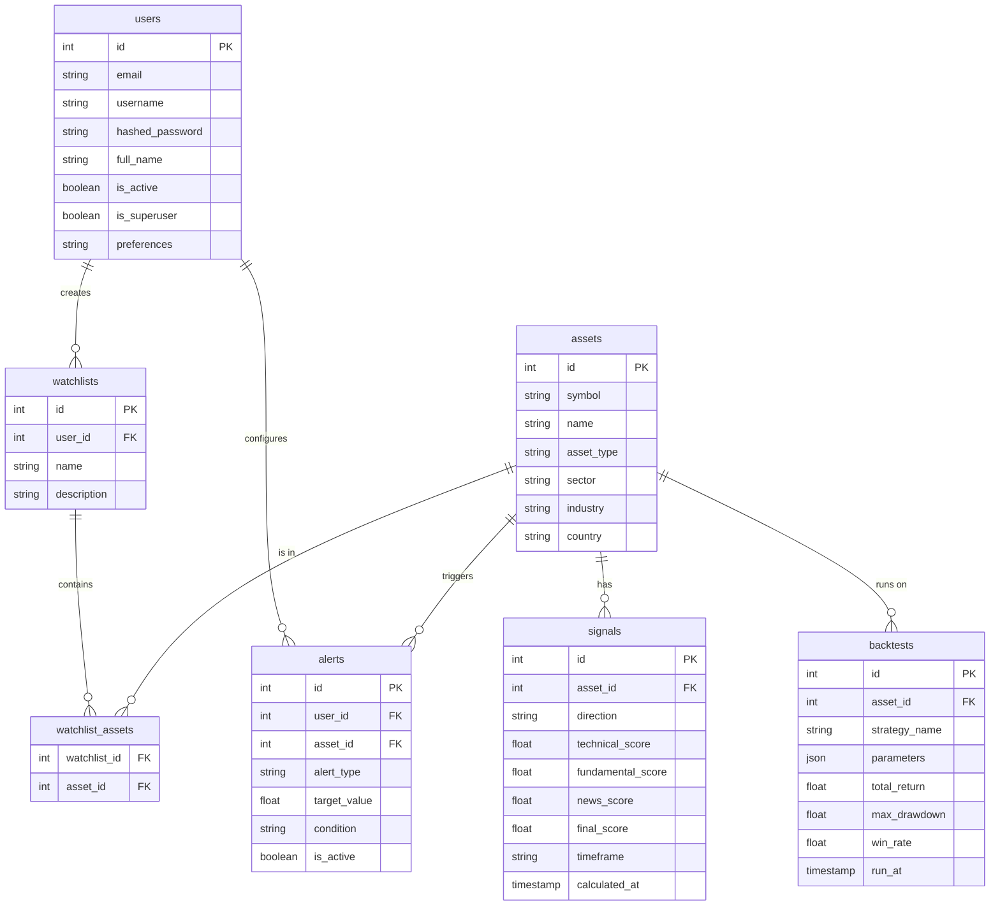

# Entity Relationship Diagram (ERD)

The following Mermaid diagram illustrates the core data models and relationships within the MarketPulse AI PostgreSQL database.

```mermaid
erDiagram
    users {
        int id PK
        string email
        string username
        string hashed_password
        string full_name
        boolean is_active
        boolean is_superuser
        string preferences
    }

    assets {
        int id PK
        string symbol
        string name
        string asset_type
        string sector
        string industry
        string country
    }

    watchlists {
        int id PK
        int user_id FK
        string name
        string description
    }

    watchlist_assets {
        int watchlist_id FK
        int asset_id FK
    }

    alerts {
        int id PK
        int user_id FK
        int asset_id FK
        string alert_type
        float target_value
        string condition
        boolean is_active
    }

    signals {
        int id PK
        int asset_id FK
        string direction
        float technical_score
        float fundamental_score
        float news_score
        float final_score
        string timeframe
        timestamp calculated_at
    }
    
    backtests {
        int id PK
        int asset_id FK
        string strategy_name
        json parameters
        float total_return
        float max_drawdown
        float win_rate
        timestamp run_at
    }

    users ||--o{ watchlists : "creates"
    users ||--o{ alerts : "configures"
    watchlists ||--o{ watchlist_assets : "contains"
    assets ||--o{ watchlist_assets : "is in"
    assets ||--o{ alerts : "triggers"
    assets ||--o{ signals : "has"
    assets ||--o{ backtests : "runs on"
```
